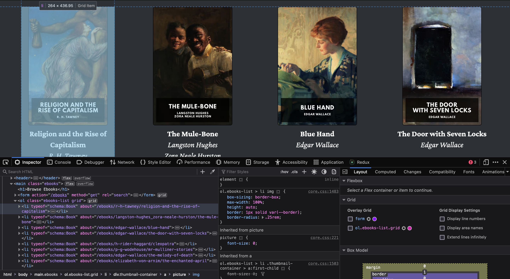

If you are someone who enjoys reading classic books on your Kindle, you might already be familiar with [Standard Ebooks](https://standardebooks.org).

> Standard Ebooks is a volunteer-driven project that produces new editions of public domain ebooks that are lovingly formatted, open source, free of U.S. copyright restrictions, and free of cost.

They take ebooks from sources like Project Gutenberg, formats and typesets them using their custom style standards and adds high quality covers to them.

However, downloading ebooks from Standard Ebooks and sending them to your Kindle via email can be a bit time-consuming due to manual work involved. As a software developer, I wanted to optimize this process and set out to find if there was any way to automate it. While there are many REST APIs available that expose metadata of the books from Project Gutenberg, I couldn't find any API for fetching metadata from Standard Ebooks. But good old web scraping comes to our rescue here.

The Standard Ebooks website is fairly simple to navigate and find all the information I need. So, without wasting any time I fired up my IDE and created a NodeJS project to write a web scraper that would help me with my problem.

Here are the detailed steps for you to follow along in case you want to build your own scraper.

## Step 1: Initialize the npm project and install puppeteer as a dependency

```bash
npm init -y && npm install puppeteer
```

## Step 2: Create an index.js file and add the following code in it

```js
import puppeteer from 'puppeteer';

async function scrapeStandardEBooks() {
  const browser = await puppeteer.launch({
    headless: 'new',
    waitForInitialPage: true
  });

  const targetURL = 'https://standardebooks.org/ebooks';
  const page = await browser.newPage();
  await page.goto(targetURL);
}
```

In the above code, we create a function called `scrapeStandardEbooks` to get started. The code is fairly straightforward. First, we initialize a new browser instance using the `puppeteer.launch()` function by passing it some options. Then we define targetURL and open a new page via the headless browser instance and navigate to the targetURL.

## Step 3: Find the required book metadata
Standard Ebooks displays the list of ebooks in `li` elements wrapped by an `ol` element with the classes `grid` and `ebooks-list`.
   

Now that we've figured out the structure of the webpage, let's quickly move on to finding the cover image, URL of the book details page, title, author, and the link for downloading the book in epub format.

```js
async function scrapeStandardEBooks() {
  // ... Previous code ...

  const bookItems = await page.$$eval('ol.ebooks-list.grid li', (elements) =>
    elements.map((element) => ({
      title: element.querySelector('[property="schema:name"]').textContent,
      author: element.querySelector('[property="schema:author"]').textContent,
      cover: element.querySelector('[property="schema:image"]').src,
      url: element.querySelector('[property="schema:url"]').href
    }))
  );
}

```

After find the URL for all the books, we create an array of `bookItems` that contains the metadata in the following format:

```json
{
  "title": "Book 1",
  "author": "Author 1",
  "cover": "url for cover image here",
  "url": "https://standardebooks.org/ebooks/author-1/book-1/"
}
```
## Step 4: Construct the download URLs for the books
Now comes the more interesting part. The ebooks listing page does not contain download links for the books. The only way to fetch the correct download link is to navigate to a book's URL and then look for the download link on that page. This is not very nice because it means we have to repeat this process for every single book.

However, download links can easily be constructed from the URLs of the books. The following code extracts the author, title (and translator(s) if there are any) from a book's URL and constructs its corresponding download URL.

```js
async function scrapeStandardEBooks() {
  // ... Previous code ...

  let books = []

  for (const bookItem of bookItems) {
    // The logic for predicting downloadURL based on the bookUrl
    let downloadUrl = '';

    const regex = /\/ebooks\/([^\/]+)\/([^\/]+)(\/([^\/]+))?$/;
    const match = bookItem.url.match(regex);

    if (match) {
      const [, author, title, translator] = match;
      const downloadPath = translator
        ? // This is needed for books translated by a person different from the author
          `${author}_${title}_${translator}.epub`
        : `${author}_${title}.epub`;
      downloadUrl = `${bookItem.url}/downloads/${downloadPath}`;
    }

    books.push({ ...bookItem, epub: downloadUrl });
  }
}
```
## Step 5: Scrape all the books from multiple pages
We're almost done now. The only remaining part is to scrape all the books, not just the ones from the first page. So, we'll update the code with logic to loop through all the pages to collect the metadata until the end of the last page is reached.

```js
import puppeteer from "puppeteer";

async function scrapeStandardEBooks() {
  const browser = await puppeteer.launch({
    headless: "new",
    waitForInitialPage: true,
  });

  const targetURL = 'https://standardebooks.org/ebooks';
  const page = await browser.newPage();
  await page.goto(targetURL);

  let nextPageExists = true; // Variable to track if next page exists

  const books = [];

  while (nextPageExists) {
    const bookItems = await page.$$eval(
      "ol.ebooks-list.grid li",
      (elements) =>
        elements.map((element) => ({
          title: element.querySelector('[property="schema:name"]').textContent,
          author: element.querySelector('[property="schema:author"]')
            .textContent,
          cover: (
            element.querySelector(
              '[property="schema:image"]'
            ) as HTMLImageElement
          ).src,
          url: (
            element.querySelector(
              '[property="schema:url"]'
            ) as HTMLAnchorElement
          ).href,
        }))
    );

    for (const bookItem of bookItems) {
      // The logic for predicting downloadURL based on the bookUrl
      let downloadUrl = "";

      const regex = /\/ebooks\/([^\/]+)\/([^\/]+)(\/([^\/]+))?$/;
      const match = bookItem.url.match(regex);

      if (match) {
        const [, author, title, translator] = match;
        const downloadPath = translator
          ? // This is needed for books translated by a person different from the author
            `${author}_${title}_${translator}.epub`
          : `${author}_${title}.epub`;
        downloadUrl = `${bookItem.url}/downloads/${downloadPath}`;
      }

      books.push({ ...bookItem, epub: downloadUrl });
    }

    const nextPageButton = await page.$('a[rel="next"]');
    nextPageExists = !!nextPageButton;

    if (nextPageExists) {
      await Promise.all([
        nextPageButton.click(),
        page.waitForNavigation({ waitUntil: "networkidle0" }),
      ]);
    }
  }

  await browser.close();

  return books;
}

scrapeStandardEBooks();
```

That's it! This scraper fetches all the books from Standard Ebooks and stores their metadata in nicely formatted objects.

You could save this list in a database and write one more script to send automated emails to your Kindle with the books as attachments. Happy reading!