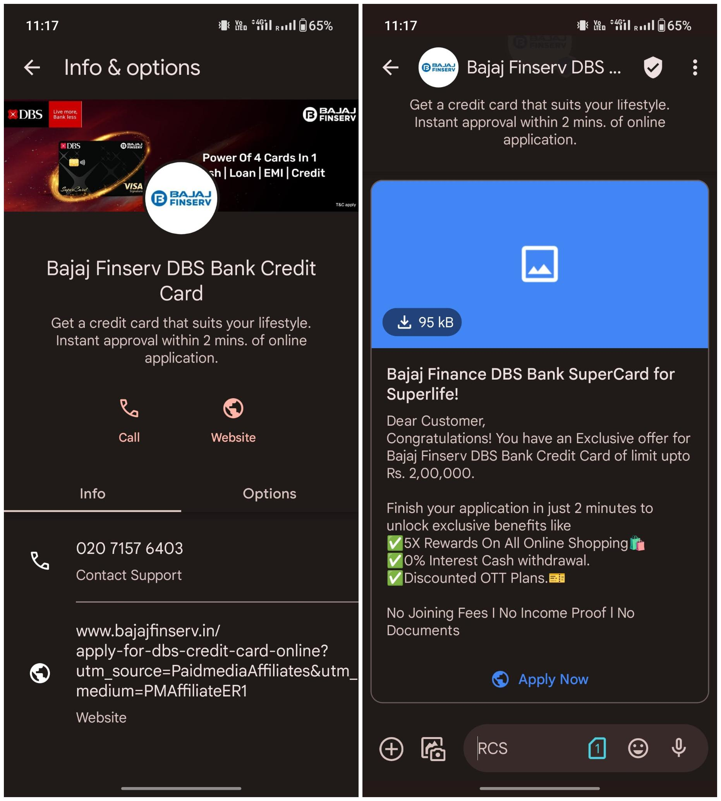
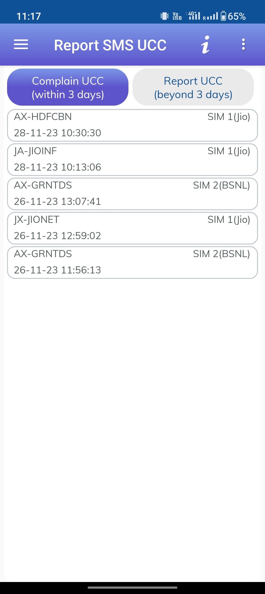

Google Messages, the standard messaging app on nearly all Android phones now, has made [RCS the default recently](https://techcrunch.com/2023/08/08/google-messages-will-now-use-rcs-by-default-and-encrypt-group-chats/).

At the first glance, it might appear like Google did this to provide better messaging experience for everyone, [including those on iOS](https://www.android.com/get-the-message/), and finally move on from the outdated SMS tech.

However, as with most big tech companies, Google's motives aren't purely altruistic. Here's an insight into one of the unintended consequences of default RCS activation.

In India, where WhatsApp is the dominant messaging platform, SMS is mainly relegated to spam and OTPs (One Time Passwords), with spam being the predominant use.

Thankfully, the Telecom Regulatory Authority of India offers a DND (Do Not Disturb) service. This allows users to opt out of marketing and promotional SMS, and it's quite effective on Android phones. If you still receive promotional SMS after opting out, you can report the sender to your carrier, who are legally bound to take action.

But as soon as RCS is enabled (which is now the default), you will magically start receiving a lot of spam messages with rich text and link previews.

Google conveniently benefits from this, as the DND app seems unable to detect these rich-format spam messages, making them impossible to report.

So, if you're using Google Messages on Android in India, I recommend disabling RCS to avoid this nuisance.